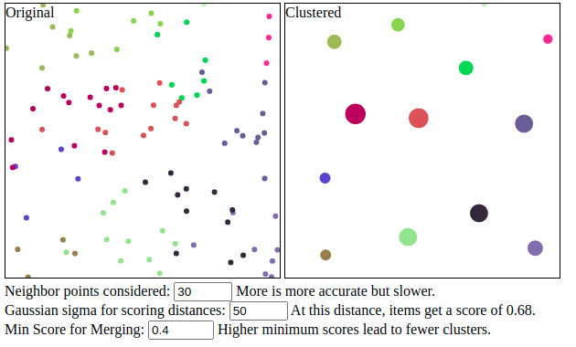

# score-clusterer
A TS/JS clustering algorithm based on a user-defined scoring function
and a threshold above which the algorithm merges clusters.

An interactive demo is available at
http://michaschwab.github.io/score-clusterer.

The user specifies a sorting function of the data, a scoring function
to define closeness or similarity between clusters, and a minimum score
above which two clusters get merged into a single cluster. 
